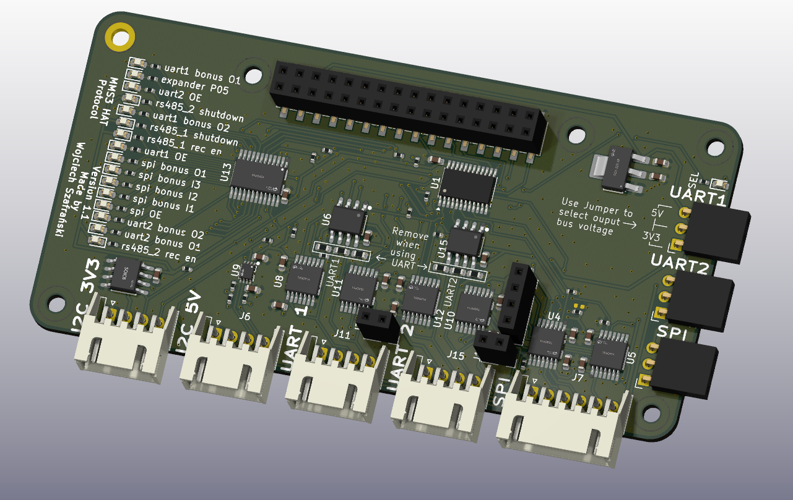

# MMS3 Hat Protocol

## Sekcja 1: Dokumentacja Hat'a

### Krótki opis projektu
Moduł rozszerzeń protokołów komunikacyjnych dla standardu ChainBus. Hat umożliwia podłączanie urządzeń zewnętrznych komunikujących się za pomocą interfejsów UART, RS485, I2C oraz SPI.

Umożliwia  zmianę napięć logicznych (3.3V lub 5V) osobno dla każdej sekcji, a linie komunikacyjne są domyślnie odłączone przy starcie systemu.

### Zgodność ze standardem ChainBus

* ✅  Używa złącza ChainBus, nie zmienia jego miejsca ani pinoutu.
* ✅  Używa wyłącznie interfejsów I2C, SPI lub UART i nie inicjuje samodzielnie nowych transmisji (Nie jest master'em I2C albo SPI).
* ✅  Spełnia wymagania mechaniczne standardu (wymiary PCB, rozstaw otworów).
* ✅  Pobiera maksymalny prąd zgodny z ilością na jednego hat'a
* ✅  Obsługuje napięcie wejściowe BRD_VIN do wartości 48V.

### Komunikacja i adresowanie

#### Adresacja I2C
Do konfiguracji pracy buforów trójstanowych oraz transceiverów RS485 wykorzystywany jest ekspander GPIO.

| Układ (IC)     | Funkcja                              | Adres I2C (7-bit) |
| :------------- | :----------------------------------- | :---------------: |
| **TCA9535PWR** | Ekspander GPIO (sterowanie buforami) | `0100000b` (0x20) |

Uwaga: Adresy expander'a gpio i pamięci EEPROM są zajęte na I2C wychodzącym z hat'a

---

### Konfiguracja i wybór napięć logicznych (3.3V / 5V)

Sekcje UART1, UART2 oraz SPI posiadają niezależną regulację napięcia pracy za pomocą zworek:

| Zworka  | Sekcja | Pozycja 1-2              | Pozycja 2-3            |
| :------ | :----- | :----------------------- | :--------------------- |
| **J8**  | UART 1 | Napięcie logiki **3.3V** | Napięcie logiki **5V** |
| **J14** | UART 2 | Napięcie logiki **3.3V** | Napięcie logiki **5V** |
| **J5**  | SPI    | Napięcie logiki **3.3V** | Napięcie logiki **5V** |

---

### Pełny pinout ekspandera GPIO (TCA9535PWR)

Wszystkie magistrale (z wyjątkiem I2C) są przy starcie urządzenia **fizycznie odłączone**. Do ich aktywacji i konfiguracji służą poniższe piny ekspandera:

| Port    | Nazwa sygnału       | Domyślny stan sprzętowy  | Opis funkcjonalny                                              |
| :------ | :------------------ | :----------------------- | :------------------------------------------------------------- |
| **P00** | `UART 1 OE`         | Niski (L) - Odłączony    | Aktywacja (Output Enable) bufora linii UART 1                  |
| **P01** | `UART 1 RS485 RE_N` | Wysoki (H)  - Wyłączony  | Negowane wejście Receiver Enable ($\overline{RE}$) dla RS485-1 |
| **P02** | `UART 1 SHDN_N`     | Wysoki (H)   - Wyłączony | Negowane wejście Shutdown ($\overline{SD}$) dla RS485-1        |
| **P03** | `UART 1 BONUS OUT`  | Niski (L)                | Dodatkowe wyjście pomocnicze (Bonus Out) na złączu J12         |
| **P04** | `UART 1 BONUS OUT`  | Niski (L)                | Dodatkowe wyjście pomocnicze (Bonus Out) na złączu J12         |
| **P05** | `STATUS LED`        | -                        | Dioda statusowa ogólnego przeznaczenia (LED)                   |
| **P06** | `UART 2 OE`         | Niski (L) - Odłączony    | Aktywacja (Output Enable) bufora linii UART 2                  |
| **P07** | `UART 2 RS485 RE_N` | Wysoki (H) - Wyłączony   | Negowane wejście Receiver Enable ($\overline{RE}$) dla RS485-2 |
| **P10** | `UART 2 SHDN_N`     | Wysoki (H) - Wyłączony   | Negowane wejście Shutdown ($\overline{SD}$) dla RS485-2        |
| **P11** | `UART 2 BONUS OUT`  | Niski (L)                | Dodatkowe wyjście pomocnicze (Bonus Out) na złączu J13         |
| **P12** | `UART 2 BONUS OUT`  | Niski (L)                | Dodatkowe wyjście pomocnicze (Bonus Out) na złączu J13         |
| **P13** | `SPI 1 ENABLE`      | Niski (L) - Odłączony    | Aktywacja (Output Enable) bufora linii SPI                     |
| **P14** | `SPI 1 BONUS IN`    | —                        | Dodatkowe wejście pomocnicze (Bonus In) na złączu J9           |
| **P15** | `SPI 1 BONUS IN`    | —                        | Dodatkowe wejście pomocnicze (Bonus In) na złączu J9           |
| **P16** | `SPI 1 BONUS IN`    | —                        | Dodatkowe wejście pomocnicze (Bonus In) na złączu J9           |
| **P17** | `SPI 1 BONUS OUT`   | —                        | Dodatkowe wyjście pomocnicze (Bonus Out) na złączu J9          |

---

### Konfiguracja trybów pracy: UART vs RS485

Linie komunikacyjne oraz złącza fizyczne są współdzielone pomiędzy standardowym interfejsem UART a różnicowym RS485. Wymaga to odpowiedniej konfiguracji sprzętowej i programowej.

#### Tryb 1: Standardowy UART
Aby używać kanału jako klasycznego interfejsu UART:
1. **Włącz magistralę:** Ustaw odpowiedni pin `UART OE` (P00 lub P06) w stan wysoki (`1`).
2. **Wylutuj rezystor terminujący:** Należy  **odlutować rezystor terminujący RS485** ($120\ \Omega$) przypisany do danego kanału (rezystory są oznaczone  na  PCB). Pozostawienie rezystora obciąży linie RX/TX, co może powodować błędy lub uszkodzenie układu.

#### Tryb 2: Interfejs RS485
Aby używać kanału w standardzie  RS485:
1. **Włącz magistralę:** Ustaw odpowiedni pin `UART OE` (P00 lub P06) w stan wysoki (`1`).
2. **Aktywuj transceiver:** Ustaw piny Receiver Enable (`RE_N`) oraz Shutdown (`SHDN_N`) w stan niski (`0`).
3. **Terminacja linii:** Rezystor terminujący na PCB powinien pozostać wlutowany .

---

### Pinout złączy zewnętrznych

#### J11 (UART1 / RS485-1) oraz J15 (UART2 / RS485-2)
Złącza te współdzielą piny fizyczne dla obu standardów komunikacji.

| Pin   | Nazwa    | Funkcja w trybie UART         | Funkcja w trybie RS485                 |
| :---- | :------- | :---------------------------- | :------------------------------------- |
| **1** | `GND`    | Masa sygnałowa                | Masa odniesienia                       |
| **2** | `V_SEL`  | Wybrane zasilanie (3.3V / 5V) | Wybrane zasilanie (3.3V / 5V)          |
| **3** | `A / RX` | Odbiór danych (RX)            | Linia różnicowa **A** (nieodwracająca) |
| **4** | `B / TX` | Nadawanie danych (TX)         | Linia różnicowa **B** (odwracająca)    |

#### J4 (I2C 3.3V) oraz J6 (I2C 5V)
Złącza magistrali I2C są połączone na stałe do linii ChainBus poprzez odpowiednie translatory poziomów.
* **J4 (3.3V):** Pin 1: GND | Pin 2: 3.3V | Pin 3: SDA 3.3V | Pin 4: SCL 3.3V
* **J6 (5.0V):** Pin 1: GND | Pin 2: 5.0V | Pin 3: SDA 5.0V | Pin 4: SCL 5.0V

#### J7 (SPI)
Złącze magistrali SPI z konwersją napięć (3.3V / 5V w zależności od J5):
* Pin 1: GND | Pin 2: V_SEL | Pin 3: SCK | Pin 4: MOSI | Pin 5: MISO | Pin 6: CS

---

### Złącza pomocnicze (Bonus Pins)

Złącza te służą do wyprowadzenia dodatkowych sygnałów cyfrowych sprzężonych z buforami danej magistrali. Działają tylko wtedy, gdy bufor nadrzędnej magistrali jest włączony (`OE` = `1`).

* **J12 (UART 1):** Pin 1: `P01` (In) | Pin 2: `P02` (Out/In) | Pin 3: `P03` (Out) | Pin 4: `P04` (Out)
* **J13 (UART 2):** Pin 1: `P07` (In) | Pin 2: `P10` (Out/In) | Pin 3: `P11` (Out) | Pin 4: `P12` (Out)
* **J9 (SPI):** Pin 1: `P14` (In) | Pin 2: `P15` (In) | Pin 3: `P16` (In) | Pin 4: `P17` (Out)

---

### Gotowe arkusze hierarchiczne
W projekcie wykorzystano następujące arkusze hierarchiczne:
* **SPI tri state switch** – Moduł przełączania linii interfejsu SPI z użyciem buforów trójstanowych oraz układów konwersji poziomów napięciowych (3.3V <-> 5V).
* **UART tri state switch + RS485 converter** – Blok przełączania linii UART z dopasowaniem poziomów napięć oraz zintegrowanym transceiverem RS485 i układem sterowania przepływem danych (RE/SHDN).

---

## Sekcja 2: Specyfikacja standardu ChainBus

### Architektura i łączenie modułów
Standard ChainBus umożliwia modułowe łączenie hatów. Na jednym MMS3 można zamontować pionowo **do 8 hat'ów**. Połączenie realizowane jest poprzez wpięcie złącza męskiego kolejnego hat'a w złącze żeńskie poprzedniego.

### Komunikacja i sterowanie
Magistrala ChainBus jest w pełni cyfrowa. Płyta główna nie steruje bezpośrednio sygnałami ogólnego przeznaczenia (GPIO) na poszczególnych hat'ach. Wszelkie operacje (np. odczyt czujników, przełączanie magistral) muszą być realizowane przez dedykowane układy scalone komunikujące się przez interfejsy systemowe.

Wybór aktywnego modułu realizowany jest przez układ przełącznika magistrali (bus switch) na płycie głównej. Dzięki temu linie I2C, SPI i UART są niezależne dla każdego hat'a (brak konfliktów adresów I2C między różnymi hatami).
* **Identyfikacja:** Każdy moduł powinien posiadać pamięć EEPROM na magistrali I2C w celu identyfikacji płyty przez system - układ M24C64-W skonfigurowany na adres `1010000` przy liniach adresowych A0, A1, A2 zwartych do masy.

### Zasilanie
Złącze ChainBus dostarcza następujące linie zasilania:

| Magistrala zasilania | Napięcie znamionowe | Maksymalny prąd (łączny dla 8 hatów) | Szacowany prąd na jeden hat |
| :------------------- | :-----------------: | :----------------------------------: | :-------------------------: |
| **5V**               |        5.0 V        |                1.0 A                 |           125 mA            |
| **12V stby**         |       12.0 V        |                0.5 A                 |            65 mA            |
| **BRD_VIN**          |   12.0 V – 48.0 V   |                1.5 A                 |           185 mA            |

*   Komponenty podłączone do linii `BRD_VIN` muszą być przystosowane do pracy z napięciem od 12V do **48 V**.

### Wymagania mechaniczne i złącza
* **Wymiary PCB:** Niedozwolona jest zmiana obrysu płytki oraz położenia otworów montażowych, aby zachować kompatybilność mechaniczną.
* **Pozycjonowanie złączy ChainBus:** Położenie złącza standardu 2x16 SMD (raster 2.54 mm) musi być zgodne z szablonem. Złącze żeńskie montowane jest na stronie FRONT, natomiast złącze męskie na stronie BACK.
* **Komponenty:** Wszystkie komponenty powinny znajdować się na stronie FRONT płytki, aby uniknąć kolizji mechanicznych z elementami sąsiadujących modułów w stosie.

---

## Sekcja 3: Licencje

### Licencje projektu

*   **PCB:** CERN-OHL-P
*   **Software:** MIT License

[Template](https://github.com/KoNaR-Hefajstos/MMS3_hat_templates/) jest na licencji CC0 1.0 Universal. **Reszta projektu nie jest na tej licencji**
